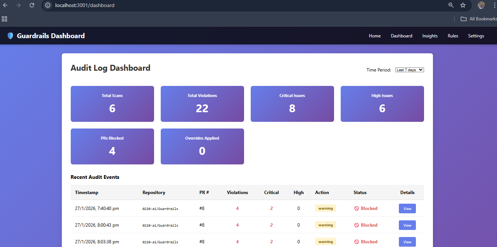

# Guardrails: Enterprise Security Guardrails for GitHub Copilot

A minimal working system that provides enterprise-grade code guardrails for GitHub Copilot workflows. This solution combines static analysis with GitHub PR integration to enforce security standards, compliance policies, and code quality checks before merge.

## Architecture

```
┌─────────────────────────────────────────────────────────────┐
│                    GitHub Repository                        │
│                                                             │
│  ┌──────────────────────────────────────────────────────┐  │
│  │         Pull Request with Code Changes               │  │
│  └──────────────────────────────────────────────────────┘  │
│                           │                                 │
│                           ▼                                 │
│  ┌──────────────────────────────────────────────────────┐  │
│  │    GitHub App (Probot) - Listens to PR Events       │  │
│  └──────────────────────────────────────────────────────┘  │
└─────────────────────────────────────────────────────────────┘
                           │
                           │ Fetches PR diff
                           │
                           ▼
┌─────────────────────────────────────────────────────────────┐
│              FastAPI Backend (Guardrails)                   │
│                                                             │
│  ┌──────────────────────────────────────────────────────┐  │
│  │        /api/analyze Endpoint                         │  │
│  │  - Parses diffs                                      │  │
│  │  - Runs security rules                              │  │
│  │  - Returns violations                               │  │
│  └──────────────────────────────────────────────────────┘  │
│                                                             │
│  ┌─────────────────────┬──────────────────────────────────┐ │
│  │  Rules Engine       │  Analyzers                       │ │
│  │  - SEC-001 (Secrets)│  - CodeAnalyzer                 │ │
│  │  - SEC-002 (SQL Inj)│  - Diff Parser                  │ │
│  │  - SEC-003 (Deser)  │  - Line Detection               │ │
│  │  - SEC-004 (Exec)   │  - File Type Filtering          │ │
│  │  - SEC-005 (Crypto) │                                │ │
│  └─────────────────────┴──────────────────────────────────┘ │
└─────────────────────────────────────────────────────────────┘
                           │
                           │ Returns violations
                           │
                           ▼
┌─────────────────────────────────────────────────────────────┐
│    GitHub App - Formats & Posts PR Comments                │
│    Shows violations grouped by severity with fixes         │
│                                                             │
│    Sample Output:                                          │
│    ✅ Critical: 1 | 🟠 High: 2 | 🟡 Medium: 0            │
│                                                             │
│    🔴 CRITICAL ISSUES                                      │
│    - Hardcoded API Key (SEC-001) at app.py:42             │
│    - SQL Injection (SEC-002) at db.py:128                 │
│                                                             │
│    🟠 HIGH ISSUES                                          │
│    - Weak Cryptography (SEC-005) at crypto.py:89          │
└─────────────────────────────────────────────────────────────┘
```

## Components

### 1. GitHub App (guardrails-github-app/)
- **Framework:** Probot (TypeScript)
- **Function:** Listens to PR events, fetches diffs, calls backend
- **Workflow:**
  1. Triggered on PR `opened` or `synchronize` events
  2. Extracts PR diffs using GitHub API
  3. Sends diff content to FastAPI backend
  4. Posts formatted violations as PR comments
  5. Shows severity icons and actionable fixes

### 2. FastAPI Backend (backend/)
- **Framework:** FastAPI (Python)
- **Function:** Analyzes code and detects violations
- **Key Features:**
  - RESTful API for code analysis
  - Pluggable rule engine
  - Diff parsing and line detection
  - Violation mapping to CWE/OWASP standards
  - Support for Copilot-generated code detection

### 3. Security Rules Engine
Built-in security rules:
- **SEC-001:** Hardcoded Secrets (API keys, passwords, tokens)
- **SEC-002:** SQL Injection patterns
- **SEC-003:** Insecure Deserialization
- **SEC-004:** Unsafe Code Execution (eval, exec, os.system)
- **SEC-005:** Weak Cryptography (MD5, SHA1, DES)

## Quick Start

### Prerequisites
- Node.js 18+ (for GitHub App)
- Python 3.11+ (for backend)
- GitHub App set up in your organization
- `BACKEND_URL` environment variable pointing to FastAPI server

### Option 1: Local Development

**Start the backend:**
```bash
cd backend
pip install -r requirements.txt
python main.py
```
Backend runs at `http://localhost:8000`

**In another terminal, start the GitHub App:**
```bash
cd guardrails-github-app
npm install
npm run build
BACKEND_URL=http://localhost:8000 npm start
```

**Test the API:**
```bash
curl http://localhost:8000/health
curl http://localhost:8000/api/rules
```

### Option 2: Docker Compose
```bash
docker-compose up
```

## Configuration

### Backend Configuration (guardrails-config.yml)
```yaml
enforcement_mode: warning  # advisory, warning, blocking

security:
  enabled: true
  block_on_critical: true
  rules:
    - SEC-001  # Hardcoded secrets
    - SEC-002  # SQL injection
    - SEC-003  # Insecure deserialization
    - SEC-004  # Unsafe execution
    - SEC-005  # Weak cryptography

copilot:
  stricter_enforcement: true
  flag_generated_code: true
```

### Environment Variables

**Backend:**
- `HOST` - Server host (default: 0.0.0.0)
- `PORT` - Server port (default: 8000)
- `DEBUG` - Enable debug mode (default: false)

**GitHub App:**
- `BACKEND_URL` - FastAPI server URL (default: http://localhost:8000)
- `APP_ID` - GitHub App ID
- `PRIVATE_KEY` - GitHub App private key
- `WEBHOOK_SECRET` - GitHub webhook secret

## API Reference

### Health Check
```
GET /health
```
Response:
```json
{
  "status": "healthy",
  "version": "0.1.0"
}
```

### Analyze PR
```
POST /api/analyze
```

Request:
```json
{
  "repo_name": "owner/repo",
  "pr_number": 123,
  "commit_hash": "abc123def456",
  "files": {
    "src/app.py": "diff content..."
  },
  "copilot_generated_files": ["src/app.py"]
}
```

Response:
```json
{
  "success": true,
  "scan_id": "uuid-string",
  "violations": [
    {
      "rule_id": "SEC-001",
      "rule_name": "Hardcoded API Key",
      "severity": "critical",
      "message": "API key detected in source code",
      "file_path": "src/app.py",
      "line_number": 42,
      "line_content": "api_key = \"sk-1234567890\"",
      "cwe_id": "CWE-798",
      "owasp_category": "A02:2021 – Cryptographic Failures",
      "is_copilot_generated": false
    }
  ],
  "violation_count": 1,
  "critical_count": 1,
  "high_count": 0
}
```

### Get Rules
```
GET /api/rules
```

Response:
```json
{
  "rules": [
    {
      "rule_id": "SEC-001",
      "name": "Hardcoded Secrets",
      "severity": "critical",
      "category": "security",
      "description": "Detects hardcoded API keys, passwords, tokens, and AWS credentials",
      "cwe": "CWE-798",
      "owasp": "A02:2021 – Cryptographic Failures"
    }
  ]
}
```

## Example PR Comment Output

When violations are detected, the GitHub App posts a comment like:

```
## 🔍 Guardrails Security Scan

**Scan ID:** `scan-uuid-123`

### Summary
- **Total Issues:** 3
- 🔴 **Critical:** 2
- 🟠 **High:** 1

### 🔴 CRITICAL Issues

<details>
<summary><b>Hardcoded API Key</b> (SEC-001) in src/app.py:42</summary>

**Issue:** Hardcoded API Key detected in source code

**Code:**
```
api_key = "sk-1234567890"
```

**CWE:** CWE-798
**OWASP:** A02:2021 – Cryptographic Failures

</details>

### 🟠 HIGH Issues

<details>
<summary><b>SQL Injection</b> (SEC-002) in src/db.py:128</summary>

...
</details>

---
**Policy:** Advisory Mode - Review these issues before merge.
*Generated by Guardrails Security Scanner*
```

## File Structure

```
guardrails/
├── guardrails-github-app/          # GitHub App (Probot)
│   ├── src/
│   │   └── index.ts                # Main app logic
│   ├── app.yml                     # GitHub App manifest
│   ├── package.json
│   └── tsconfig.json
│
├── backend/                         # FastAPI backend
│   ├── app/
│   │   ├── main.py                 # FastAPI application
│   │   ├── models/
│   │   │   └── violation.py        # Data models
│   │   ├── rules/
│   │   │   └── security_rules.py   # Security rules
│   │   ├── analyzers/
│   │   │   └── code_analyzer.py    # Code analysis logic
│   │   └── config/
│   │       └── settings.py         # Configuration
│   ├── requirements.txt
│   ├── main.py                     # Entry point
│   ├── Dockerfile
│   └── README.md
│
├── docker-compose.yml
├── README.md                       # This file
└── guardrails-config.yml           # Policy configuration
```

## Features

✅ Security rules engine
✅ GitHub PR integration
✅ PR comment posting
✅ Violation severity levels
✅ CWE/OWASP mapping
    Dashboard


## Dashboard



## Security Notes

- **No source code retention:** Code is analyzed in-memory only
- **Secret scanning:** API keys, tokens, passwords are flagged
- **No external calls:** All analysis happens locally
- **GitHub webhook validation:** Requests are verified
- **Zero trust:** Assume all code inputs are untrusted

## Development

### Adding New Security Rules

1. Add pattern to `backend/app/rules/security_rules.py`:
```python
NEW_PATTERN_PATTERNS = [
    (r"pattern_regex", "Rule name"),
]
```

2. Add scan method:
```python
violations.extend(
    SecurityRuleEngine.scan_line(
        line,
        file_path,
        line_number,
        SecurityRuleEngine.NEW_PATTERN_PATTERNS,
        "SEC-XXX",
        "CWE-YYYY",
        "OWASP Category",
        SeverityLevel.HIGH,
    )
)
```

### Testing

**Backend:**
```bash
cd backend
# Create test files in tests/ directory
pytest tests/
```

**GitHub App:**
```bash
cd guardrails-github-app
npm test
```

## Troubleshooting

### Backend not responding
- Check if `BACKEND_URL` env var is set in GitHub App
- Ensure backend is running: `curl http://localhost:8000/health`
- Check firewall/network accessibility

### No violations found
- Verify PR has code changes
- Check that file extensions match supported languages
- Review security rules in `/api/rules` endpoint

### GitHub App not triggering
- Verify `pull_request` event is enabled in `app.yml`
- Check webhook delivery in GitHub App settings
- Review logs: `npm run dev` for local testing

## Contributing

This is a minimal working prototype. Areas for contribution:
- Additional security rules
- Performance optimization
- Better diff parsing
- Enhanced error handling
- Documentation improvements


## Support

For issues and questions:
1. Check the logs
2. Review the API response status codes
3. Verify environment configuration
4. Check GitHub webhook delivery attempts

---

**Built with:** Probot, FastAPI, TypeScript, Python  
**Status:** Minimal Working System (MVP)
